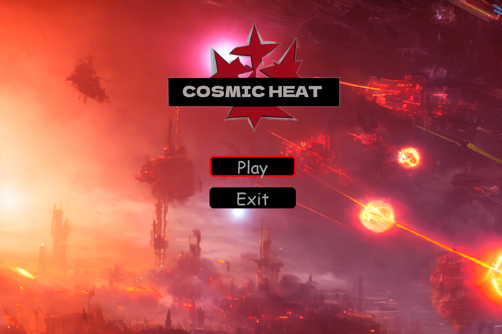

# Cosmic Fire
Just a 2D space shooter from a neighboring parallel world. It was written using Python and Pygame. The game is still being updated. To control the player, you can use either the keyboard or a joystick. The game features a variety of cool bosses and enemies that will challenge your skills and keep you engaged. Get ready to blast your way through waves of enemy ships and take on epic boss battles in this exciting space adventure!

A simple 2D space shooter game to understand how pygame works and improve development skills. To control can use either keyboard or mousepad. The game includes multiple levels as you progress further increasing in difficulty. As well as various enemies and boss battles. The scores are saved and you can try and beat your highscore

## How to Run:
 - git clone https://github.com/Dave-YP/cosmic-heat-pygame.git
 - cd cosmic-heat-pygame
 - python -m venv env
 - source env/Scripts/activate
 - pip install -r requirements.txt
 - python game.py

 ## Controls:
 - shoot - SPACE
 - move - arrows
 - pause - P
 - exit - Esc

## Images

